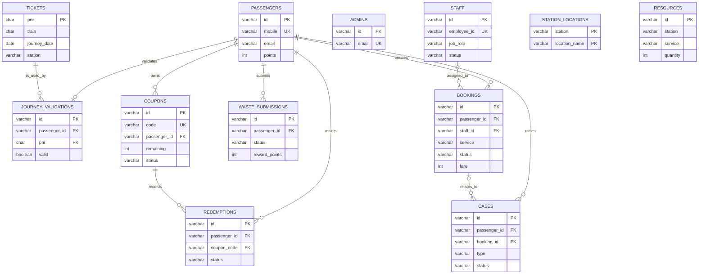

# EcoAccess Entity Relationship Diagram

This diagram represents the PostgreSQL structure defined in `sql/01_schema.sql`. Cardinalities show database relationships; `resources` and `station_locations` use station names as master-data values rather than a separate `stations` table.

## Tabular ER model

### Entities and attributes

| Entity / table | Primary key | Foreign key(s) | Important attributes | Purpose |
|---|---|---|---|---|
| **Passenger** (`passengers`) | `id` | — | `name`, `mobile` (unique), `email`, `password_hash`, `points` | Stores passenger login details and reward wallet. |
| **Staff** (`staff`) | `id` | — | `employee_id` (unique), `name`, `job_role`, `status`, `password_hash` | Stores staff login, job role, and availability. |
| **Admin** (`admins`) | `id` | — | `name`, `email` (unique), `password_hash` | Stores seeded administrator login details. |
| **Ticket** (`tickets`) | `pnr` | — | `train`, `journey_date`, `journey_time`, `station`, `platform`, `origin`, `destination` | Stores the demo PNR ticket catalogue. |
| **Journey Validation** (`journey_validations`) | `id` | `passenger_id → passengers.id`; `pnr → tickets.pnr` | `valid`, `validated_at` | Stores one currently validated journey for each passenger. |
| **Resource** (`resources`) | `id` | — | `station`, `service`, `quantity` | Stores wheelchair or inter-vehicle stock by station. `station + service` is unique. |
| **Booking** (`bookings`) | `id` | `passenger_id → passengers.id`; `staff_id → staff.employee_id` (optional) | `service`, `station`, `pickup`, `drop_location`, `fare`, `status`, `passenger_count` | Stores booked assistance services and their staff workflow status. |
| **Waste Submission** (`waste_submissions`) | `id` | `passenger_id → passengers.id` | `photo_path`, `status`, `reward_points`, `submitted_at`, `remark` | Stores passenger waste-disposal proof submitted for review. |
| **Coupon** (`coupons`) | `id` | `passenger_id → passengers.id` | `code` (unique), `value`, `remaining`, `status`, `expires_at` | Stores coupons generated from reward-point redemption. |
| **Redemption** (`redemptions`) | `id` | `passenger_id → passengers.id`; `coupon_code → coupons.code` | `points`, `coupon_value`, `status`, `redemption_date` | Stores reward-points-to-coupon conversion history. |
| **Case** (`cases`) | `id` | `passenger_id → passengers.id`; `booking_id → bookings.id` (optional) | `type`, `rating`, `subject`, `description`, `status` | Stores both feedback and complaints. |
| **Station Location** (`station_locations`) | Composite: `station`, `location_name` | — | `station`, `location_name` | Stores pickup/drop location choices for each station. |

### Relationships and cardinalities

| No. | Parent entity | Child entity | Relationship | Cardinality | Foreign-key implementation |
|---:|---|---|---|---|---|
| 1 | Passenger | Journey Validation | A passenger validates a journey. | Passenger **1 : 0..1** Journey Validation | `journey_validations.passenger_id` is both an FK and unique. |
| 2 | Ticket | Journey Validation | A ticket can be validated by passengers. | Ticket **1 : 0..many** Journey Validations | `journey_validations.pnr → tickets.pnr` |
| 3 | Passenger | Booking | A passenger creates bookings. | Passenger **1 : 0..many** Bookings | `bookings.passenger_id → passengers.id` |
| 4 | Staff | Booking | Staff may be assigned to bookings. | Staff **1 : 0..many** Bookings; Booking **0..1** Staff | `bookings.staff_id → staff.employee_id`; it is nullable for unassigned bookings. |
| 5 | Passenger | Waste Submission | A passenger submits waste proof. | Passenger **1 : 0..many** Waste Submissions | `waste_submissions.passenger_id → passengers.id` |
| 6 | Passenger | Coupon | A passenger owns generated coupons. | Passenger **1 : 0..many** Coupons | `coupons.passenger_id → passengers.id` |
| 7 | Passenger | Redemption | A passenger redeems reward points. | Passenger **1 : 0..many** Redemptions | `redemptions.passenger_id → passengers.id` |
| 8 | Coupon | Redemption | A redemption references its generated coupon. | Coupon **1 : 0..many** Redemptions in the database; **1 : 1** in the current passenger redemption flow | `redemptions.coupon_code → coupons.code` |
| 9 | Passenger | Case | A passenger submits feedback or a complaint. | Passenger **1 : 0..many** Cases | `cases.passenger_id → passengers.id` |
| 10 | Booking | Case | A complaint can relate to a booking. | Booking **1 : 0..many** Cases; Case **0..1** Booking | `cases.booking_id → bookings.id`; nullable for feedback. |

### Important relationship rules

| Rule | Explanation |
|---|---|
| One active journey per passenger | A unique constraint on `journey_validations.passenger_id` replaces an older journey when a new PNR is validated. |
| Booking staff assignment is optional | A booking begins as `Booked` when no suitable staff member is available; therefore `staff_id` may be `NULL`. |
| Complaint booking is optional at database level | The application requires it for complaints, but feedback has no booking requirement; this is why `booking_id` is nullable. |
| Resources are station-based, not ticket-based | Inventory is identified by station name and service type, as specified by the frontend source of truth. |
| Admin has no operational FK relationship | Admin is an authentication/authorization entity; admin actions are not stored as audit records in the stated requirements. |

## Relationship summary

| Parent | Child | Meaning |
|---|---|---|
| Passenger | Journey validation | A passenger can have zero or one current validated journey. |
| Ticket | Journey validation | One demo PNR ticket can be validated by many passengers. |
| Passenger | Booking | A passenger can create many bookings. |
| Staff | Booking | A booking may be unassigned or linked to one staff employee ID; staff can handle many bookings. |
| Passenger | Waste submission | A passenger can submit many waste records. |
| Passenger | Coupon / redemption | A passenger owns coupons and has reward conversion history. |
| Coupon | Redemption | Each redemption references the coupon it generated. |
| Passenger / booking | Case | Feedback or complaint belongs to a passenger; a complaint can reference a booking. |

`admins` is intentionally independent because it is used only for admin authentication in the current requirement set. `resources` is keyed by station and service type for stock tracking; station names are not normalized into a separate table by the supplied specification.
